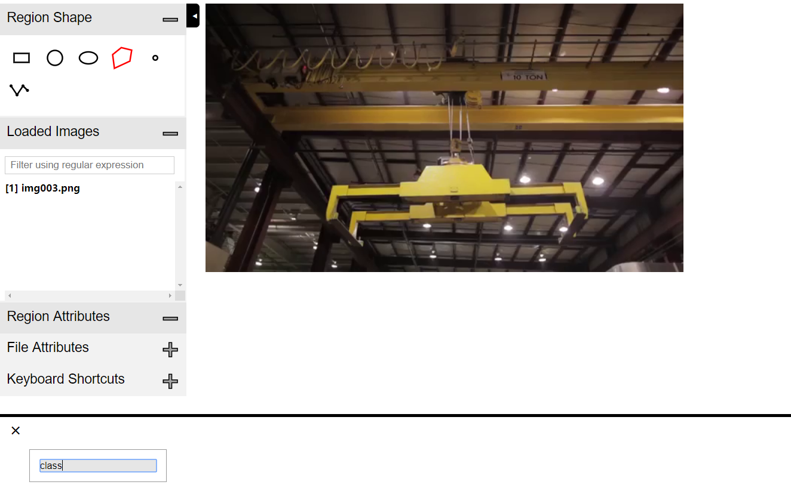

# Training on Your Own Dataset Step by Step
Labeling Tool: Suggest to use [VIA 1.0.6](http://www.robots.ox.ac.uk/~vgg/software/via/via-1.0.6.html).

Runtime：[This docker image](https://hub.docker.com/r/waleedka/modern-deep-learning/).

Original repo: [matterport/mask_RCNN](https://github.com/matterport/Mask_RCNN)
## Introduction: 
I want to divide a crane into different parts. 

The parts' division:


Class Names = ['connection', 'claw']

In my case, 'claw' class has 2 instances, 'connection' has 1.
## Step by step label my crane dataset via VIA
Firstly, import pictures, then click the "+" button in below picture's circle 1. Then add "class" section.




Secondly, use polygon labeling tool to label the crawl:


Then next claw instance:


Finally, connection instance:


Save annotation as json format(Don't need to rename!), and copy it to <repo_root_path>/data/balloon/train or val
## Fix your codes
71, 91, 92, 130, 175-178, 278 lines of code in samples/balloon/balloon.py should be changed according to your dataset.
## Training
Go into docker container:
```c
cd <repo_root_path>
docker run --gpus all -it -v $(pwd):/maskRCNN -v /tmp/.X11-unix:/tmp/.X11-unix -e DISPLAY=unix$DISPLAY waleedka/modern-deep-learning bash
```
All commands below are run in docker container:
```c
cd maskRCNN/samples/balloon
sh train.sh
```
## Prediction
All commands below are run in docker container:
```c
cd maskRCNN/samples/balloon
sh predict.sh
```
